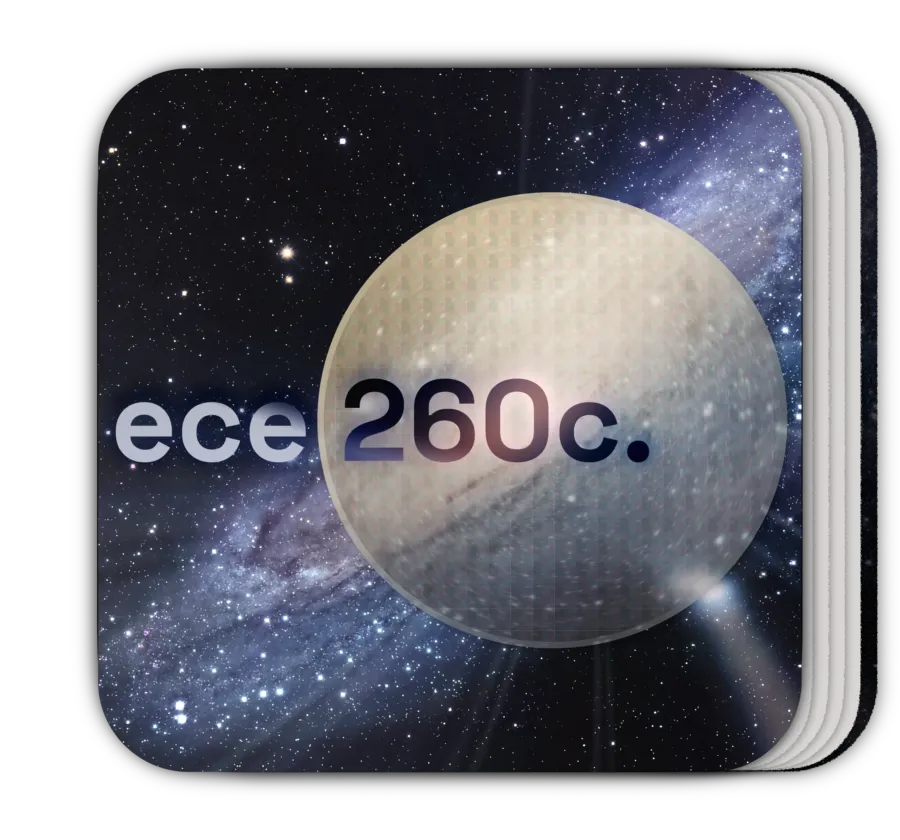

# ECE 260C (Course Contents)

This repository contains files for the ECE 260C course. [Review the main course website for more information.](https://abkcourses.github.io/ece260c)

## Documents

The documents (lab reports, software setup guide, ...) enclosed here are exports from Google Docs. Please see the course website for the originals.

Issues with the originals should be reported in the Issues tab of this repo.

### Fonts

The original documents use the following fonts: Space Grotesk, IBM Plex Sans, Consolas.

## Lecture Slides

The PPTX lecture slides enclosed here are the originals. PDF exports are also included.

## Problems?

Issues with any ECE 260C course content, whether in this repo or not, should be filed in this repo [here](https://github.com/ABKCourses/ece260c-contents/issues/new).

For tooling issues or other inquiries, see the course website.

